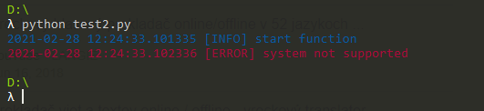

# PyLog library

## Instalation

```sh
$ git clone https://github.com/MartinMatta/PyLog
$ cd PyLog
$ python setup.py install
```

## Example 1

test1.py

```python
from PyLog.colors import *
from PyLog.log import Log

log = Log()

try:
    import cv2
except ImportError:
    log.e("no module named cv2", tag="ImportError")
```


## Example 2

test2.py

```python
from PyLog.colors import *
from PyLog.log import Log
import os

class App(Log):

    def __init__(self):
        super().__init__(self)

    def start(self):
        self.i("start function") # info

        if os.name == "posix":
            # code
            pass
        else:
            self.e("system not supported")


app = App()
app.start()
```

